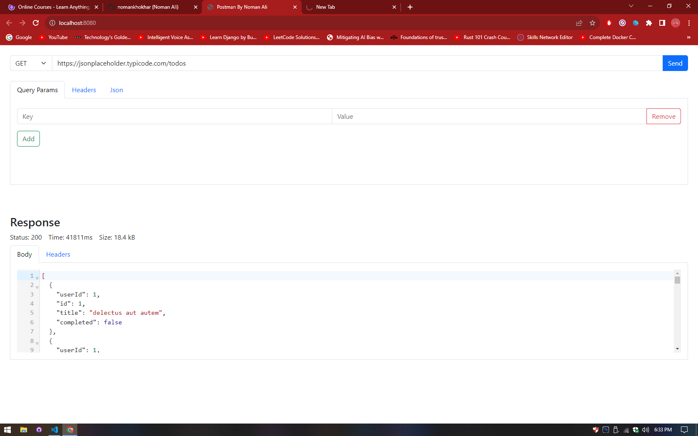

# Postman Build with JavaScript and CodeMirror Package

This is project that build with JavaScript, In this project you can do GET, POST, PATCH, DELETE Request and Also add header and josn responce into API

## Funcationality

 - GET
 - POST
 - PUT
 - DELETE

## Authors

- [@nomankhokhar](https://www.github.com/nomankhokhar)

## Badges

## 🚀 About Me

I'm a full Stack Developer...